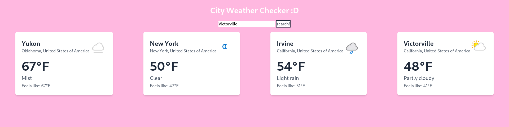

# odin-weatherApp 

This is a weather finder app by city javascript app! This is for the odin project [JavaScript Weather App](https://www.theodinproject.com/lessons/javascript-weather-app)
  
To use the project all you need to do is type in the city or zip you are looking for and it will return the card with the current weather. The max cards on screen is six.
# Technologies  
I am using WeatherAPI to fetch the weather data. 
I used tailwindcss for all the styling.  
I used Claude to make a function per assignment constraint.
# What I learned  
This project was very useful as a refresher to index nth child html elements from javascript!
# Dependencies  
@tailwindcss/cli: ^4.0.14
tailwindcss: "^4.0.14
# Running on your local machine
You will need to used npm install
Next use -> npx @tailwindcss/cli -i ./styles/styles.css -o ./styles/output.css --watch
Then open the index.html file with something like liveserver in vscode!
